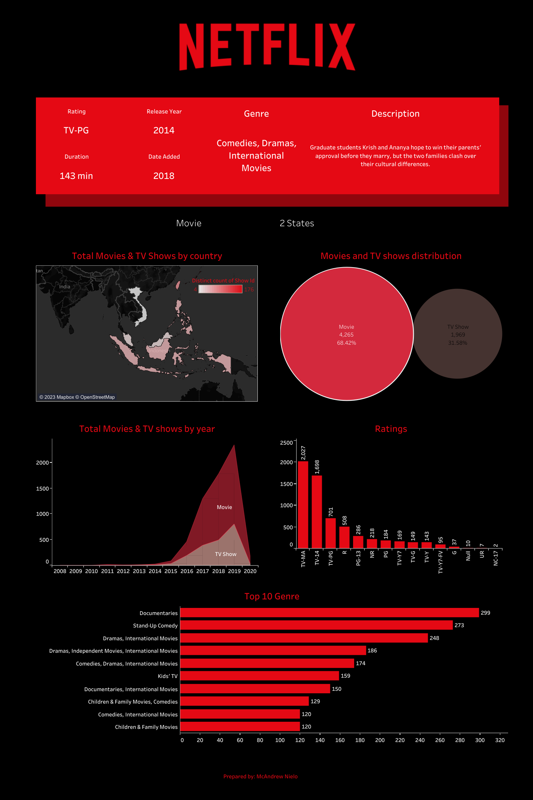

# 🎞️ Netflix Dashboard Challenge

## 📑ABOUT THE DATA

This dataset appears to contain information about movies and TV shows available on Netflix. Here is a brief description of the columns in the dataset:

1. **show_id**: An identifier for the show or movie.
2. **type**: Indicates whether the entry is a movie or a TV show.
3. **title**: The title of the movie or TV show.
4. **director**: The director(s) of the movie or TV show (if available).
5. **cast**: The main cast members of the movie or TV show.
6. **country**: The country or countries associated with the production of the movie or TV show.
7. **date_added**: The date when the movie or TV show was added to Netflix.
8. **release_year**: The year when the movie or TV show was released.
9. **rating**: The content rating for the movie or TV show.
10. **duration**: The duration or runtime of the movie or TV show.
11. **listed_in**: The categories or genres the movie or TV show is listed under on Netflix.
12. **description**: A brief description or synopsis of the movie or TV show's plot or content.

The dataset appears to contain information about two entries, one being a movie titled "Norm of the North: King Sized Adventure" and the other a stand-up comedy show by Jandino Asporaat titled "Jandino: Whatever it Takes." Each entry provides details such as the release year, country of production, cast, duration, and a description of the content.

## 💡 HIGHLIGHTS

1. **Content Type Distribution:**
   - There are both movies and TV shows in the dataset.
   - The dataset contains a mix of movie titles and TV show titles.

2. **Country of Production:**
   - The content comes from various countries, including the United States, India, South Korea, China, the United Kingdom, Spain, Bulgaria, Canada, Chile, the Netherlands, Belgium, Denmark, Sweden, and more.

3. **Release Year:**
   - The dataset covers content released from 2008 to 2020.
   - Most of the content appears to be relatively recent, with a focus on the 2010s.

4. **Ratings:**
   - The content has different content ratings, such as TV-PG, TV-MA, TV-Y7-FV, TV-Y7, TV-14, TV-Y, and R.
   - This indicates a variety of target audiences and content maturity levels.

5. **Duration:**
   - The duration of the content varies, with some entries in minutes (e.g., 90 min, 94 min) and others in seasons (e.g., 1 Season).
   - This suggests a mix of movie-length and episodic content (TV shows).

6. **Genres:**
   - The dataset includes content from various genres, such as Children & Family Movies, Comedies, Stand-Up Comedy, Kids' TV, Action & Adventure, Docuseries, Sci-Fi & Fantasy, Cult Movies, Dramas, Independent Movies, Romantic Movies, and Documentaries.
   - This reflects the diversity of content available on Netflix.

7. **Date Added to Netflix:**
   - The content was added to Netflix on different dates, ranging from 2008 to 2020.

8. **Directors:**
   - There are multiple directors responsible for the content, indicating a variety of creators and production teams.

9. **Descriptions:**
   - Each entry has a brief description or synopsis that provides an overview of the content's plot or theme.

10. **Title Names:**
    - There is a variety of titles, ranging from original titles to stand-up comedy shows and TV series.

Overall, this dataset showcases the diverse range of content available on Netflix, including movies and TV shows from different countries, genres, and content ratings. It provides valuable information for viewers and content creators interested in understanding the platform's offerings. Further analysis could involve exploring trends in content distribution, content production by country, or viewer preferences based on ratings and genres.

## 📊 VISUALIZATION

One page tableau dashboard about Netflix.

Tableau: [Link](https://public.tableau.com/app/profile/mcandrew.nielo/viz/NetflixDashboard_16938373428080/Netflix)
